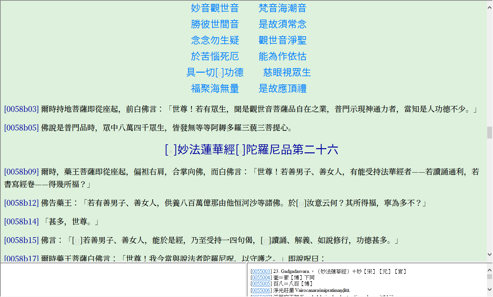

# cbeta css

這個是個人根據網路上的css及CBETA Reader自帶的css修改後的結果。

## 主要改動

- 使用[思源宋體](https://github.com/adobe-fonts/source-han-serif/tree/release)和[思源黑體](https://github.com/adobe-fonts/source-han-sans)字體分別作爲襯線體和無襯線體。兩種字體皆爲開緣免費字體，使用時注意下載合適版本
- 調整字體大小，題名和卷名字體調大，正文單倍行距
- 題名、卷名、偈頌調整爲居中。其中偈頌第一行出現縮進問題，暫時用text-indent調整
- 爲保證部分調整生效，將一些樣式改爲display:block
- 註釋編號字體和顏色調小，避免影響閱讀

## 使用方法

- 下載cbeta.css，複製到CBETA Reader所在目錄
- 打開CBETA Reader, 點擊「設置」-˃「選項設定」-˃「字型格式」，勾選「使用自訂CSS」
- *點擊「儲存」*
- 樣式如未立即生效，重啓CBETA Reader即可

## Q&A

如遇到顯示問題，歡迎提Issue

## 案例

